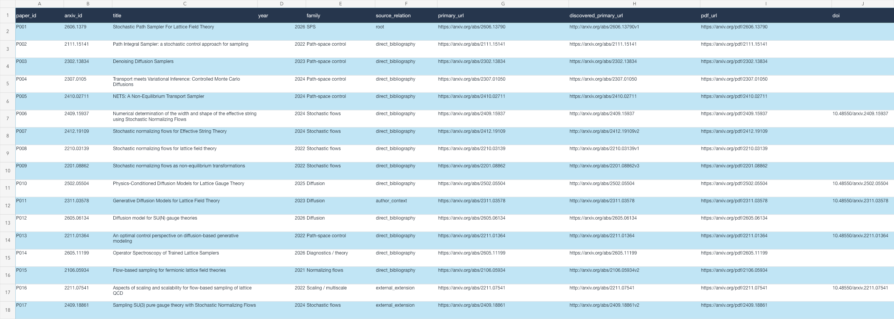
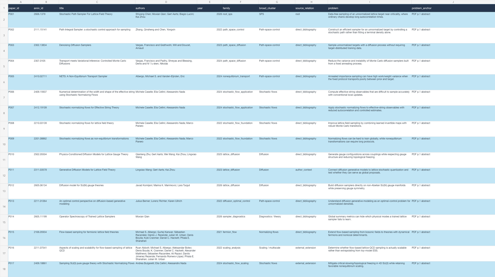
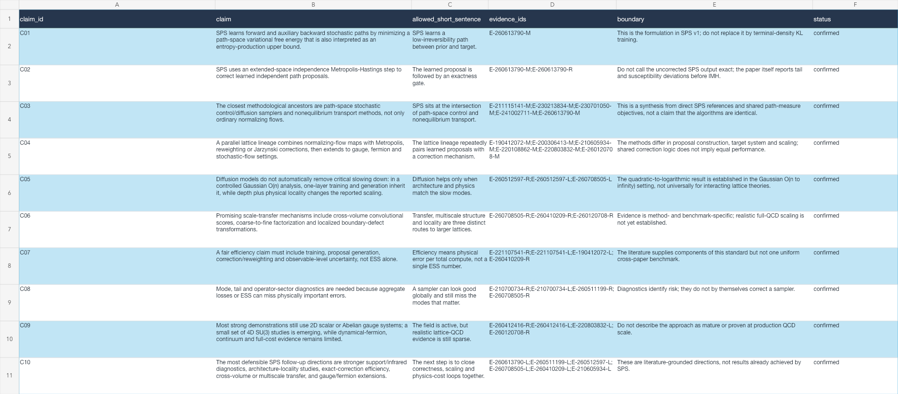
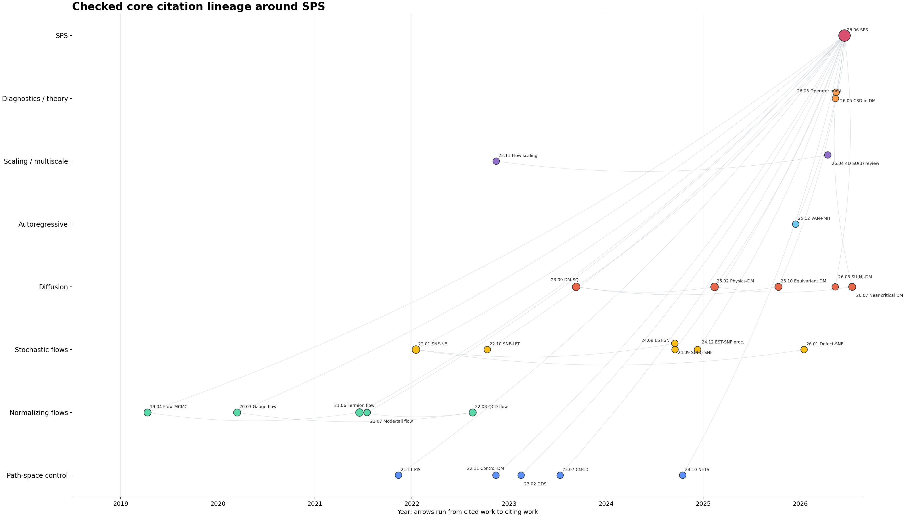

# Play the Toy with Children

Turn a spoken research clue into a literature package that another person can
check.

**Part 1 is complete:** identify the exact object, expand the search in several
rounds, read the selected papers, connect every retained claim to a source, and
leave unresolved questions visible. The public worked example is the
Stochastic Path Sampler (SPS). We are extending the same approach to the later
steps of research: methods, experiments, proposals, papers, and presentations.

```text
verbal clue -> exact target -> candidate pool -> paper reading
            -> claim/source ledger -> lineage -> gaps -> report
```

Part 1 public package: **2026-07-13**

Repository: <https://github.com/qxxmax/skillforpaper>

## Try it first: no installation

Paste this into Codex, ChatGPT, or another research assistant:

```text
I will give you a paper, field, or verbal research clue.

First confirm the exact target: title, authors, version, date, DOI/arXiv, and
primary page. Then search in several rounds through references, citations,
authors, collaborators, source-derived keywords, and adjacent methods. Return
to the original sources in every round.

Give me a source table, per-paper reading notes, a claim/source/boundary table,
a literature lineage, unresolved gaps, and a short report. Every number, date,
identity, and performance claim must have a source. Mark anything unresolved as
pending.
```

This is the quickest way to try the method. It does not automatically load the
repository's templates, scripts, or validators.

## Use the full Codex skill

Install once by sending this message in Codex:

```text
Use the skill-installer skill to install:
https://github.com/qxxmax/skillforpaper/tree/main/play-the-toy-with-children
```

Then start a new Codex task:

```text
Use $play-the-toy-with-children for Part 1 literature research.
Topic: [paper, field, or verbal clue]

Confirm the target, expand the search repeatedly, read the selected papers,
return to the original sources, and produce the source table, reading records,
claim/source ledger, lineage, gaps, and report.
```

The core workflow needs no API key and no extra Python packages.

## One real case: SPS

The starting clue was: **"Moxian Qian's recent stochastic path sampler
paper."** The first step locked it to:

> Shiyang Chen, Moxian Qian, Gert Aarts, Biagio Lucini, and Kai Zhou,
> *Stochastic Path Sampler For Lattice Field Theory*, arXiv:2606.13790v1,
> submitted 2026-06-11.

The same fixed output contract was run once as an ordinary orchestrated task
and once in Codex Goal mode:

| Recorded metric | `gpt-5.6-sol` / xhigh ordinary run | Codex Goal mode |
|---|---:|---:|
| Wall time | 22 min 25 s | 23 min 53 s |
| Deduplicated candidates | 578 | 578 |
| Source PDFs / verified pages | 27 / 611 | 27 / 611 |
| Evidence records | 108 | 108 |
| Direct citation edges checked | 58 / 58 | 58 / 58 |
| Final validation | PASS | PASS |

This supports workflow reproducibility under the recorded contract. It is not
a strict model benchmark: Goal mode did not expose its exact deployment model,
and exact token/cache counters were unavailable for these matched runs. See the
[full comparison and boundaries](sps/comparison/cost_effect_summary.md).

## What the results look like

These are real pages from the SPS output package. Click any image to inspect
the full-resolution table or graph.

### Source table

Exact paper identities, source links, access status, and verification notes:

[](sps/runs/codex-goal-mode-cleanroom/qa_workbook/sources.png)

### Per-paper reading records

Problem, method, result, limitation, and source anchor for each promoted paper:

[](sps/runs/codex-goal-mode-cleanroom/qa_workbook/reading_notes.png)

### Claim, source, and boundary table

What can be written, which source supports it, and where the wording must stop:

[](sps/runs/codex-goal-mode-cleanroom/qa_workbook/claims.png)

### Literature lineage

Checked citation and method relations, used to locate branches and remaining
gaps:

[](sps/runs/codex-goal-mode-cleanroom/graphs/citation_lineage_graph.png)

## Inspect the detailed result

| Open | What it shows |
|---|---|
| [SPS case overview](sps/README.md) | Where the case starts and how the files fit together |
| [Complete Dijkstra run](sps/runs/codex-goal-mode-full-dijkstra-20260713/README.md) | The executed search, reading, graph, gap-closure, and validation stages |
| [Native SPS paper reading record](sps/runs/codex-goal-mode-full-dijkstra-20260713/native_paper_reading_record_sps.md) | Identity, equations, experiments, numbers, boundaries, and source anchors |
| [Audit workbook](sps/runs/codex-goal-mode-full-dijkstra-20260713/sps_literature_audit_full_dijkstra.xlsx) | Source, reading, evidence, relation, number, and gap tables in one workbook |
| [Ordinary run vs Goal mode](sps/comparison/cost_effect_summary.md) | Matched results, measured cost, and comparison limits |
| [With vs without Dijkstra](sps/comparison/dijkstra_effect_and_cost.md) | Equal-budget selection effect and the costs that were actually observed |
| [Final validation report](sps/runs/codex-goal-mode-full-dijkstra-20260713/final_validation_report.md) | The 19 checked output gates and their status |

Downloaded third-party papers and full-text caches are not distributed.

<details>
<summary><strong>Manual installation and optional extras</strong></summary>

Clone and install:

```bash
git clone https://github.com/qxxmax/skillforpaper.git
cd skillforpaper
python3 install.py
python3 install.py --check
```

On Windows, use `py` instead of `python3`. To update an existing installation
after `git pull --ff-only`, run `python3 install.py --update`.

The core workflow and its Markdown/CSV validators need no optional package.
Graph rendering uses `matplotlib` and `networkx`. Exact API token and cost
accounting additionally needs the `openai` package, an API key, and an explicit
price file.

```bash
python3 -m pip install -r requirements-optional.txt
```

</details>

<details>
<summary><strong>Six-part roadmap</strong></summary>

| Part | Research step | Status |
|---|---|---|
| 1 | Understand the literature: identify, search, read, trace, and audit | Public and tested |
| 2 | Learn current methods, formulas, implementations, and progress | Planned |
| 3 | Design, execute, diagnose, and validate the research | Planned |
| 4 | Prepare a complete research or funding proposal | Planned |
| 5 | Write, choose a venue, submit, and revise the paper | Planned |
| 6 | Produce slides, posters, and talks for different audiences | Planned |

</details>

## License status

This repository is public, but no software license has been selected yet.
Public visibility permits reading and cloning; permission to modify,
redistribute, or create derivative works is not granted until the repository
owner adds a license.
