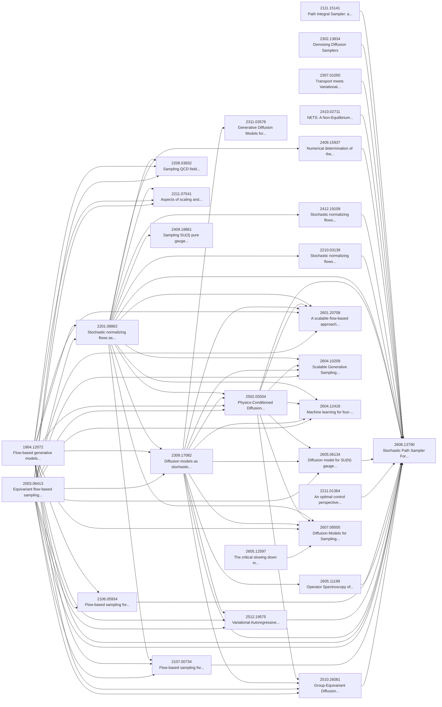

# SPS Literature Lineage

```mermaid
flowchart LR
  N190412072["1904.12072<br/>Flow-based generative models..."]
  N200306413["2003.06413<br/>Equivariant flow-based sampling..."]
  N210605934["2106.05934<br/>Flow-based sampling for..."]
  N210700734["2107.00734<br/>Flow-based sampling for..."]
  N211115141["2111.15141<br/>Path Integral Sampler: a..."]
  N220108862["2201.08862<br/>Stochastic normalizing flows as..."]
  N220803832["2208.03832<br/>Sampling QCD field..."]
  N221003139["2210.03139<br/>Stochastic normalizing flows..."]
  N221101364["2211.01364<br/>An optimal control perspective..."]
  N221107541["2211.07541<br/>Aspects of scaling and..."]
  N230213834["2302.13834<br/>Denoising Diffusion Samplers"]
  N230701050["2307.01050<br/>Transport meets Variational..."]
  N230917082["2309.17082<br/>Diffusion models as stochastic..."]
  N231103578["2311.03578<br/>Generative Diffusion Models for..."]
  N240915937["2409.15937<br/>Numerical determination of the..."]
  N240918861["2409.18861<br/>Sampling SU(3) pure gauge..."]
  N241002711["2410.02711<br/>NETS: A Non-Equilibrium..."]
  N241219109["2412.19109<br/>Stochastic normalizing flows..."]
  N250205504["2502.05504<br/>Physics-Conditioned Diffusion..."]
  N251026081["2510.26081<br/>Group-Equivariant Diffusion..."]
  N251219575["2512.19575<br/>Variational Autoregressive..."]
  N260120708["2601.20708<br/>A scalable flow-based approach..."]
  N260410209["2604.10209<br/>Scalable Generative Sampling..."]
  N260412416["2604.12416<br/>Machine learning for four-..."]
  N260506134["2605.06134<br/>Diffusion model for SU(N) gauge..."]
  N260511199["2605.11199<br/>Operator Spectroscopy of..."]
  N260512597["2605.12597<br/>The critical slowing down in..."]
  N260613790["2606.13790<br/>Stochastic Path Sampler For..."]
  N260708505["2607.08505<br/>Diffusion Models for Sampling..."]
  N211115141 --> N260613790
  N230213834 --> N260613790
  N230701050 --> N260613790
  N241002711 --> N260613790
  N240915937 --> N260613790
  N241219109 --> N260613790
  N221003139 --> N260613790
  N220108862 --> N260613790
  N250205504 --> N260613790
  N260506134 --> N260613790
  N221101364 --> N260613790
  N260511199 --> N260613790
  N210605934 --> N260613790
  N251219575 --> N260613790
  N230917082 --> N260613790
  N190412072 --> N260613790
  N200306413 --> N260613790
  N210700734 --> N260613790
  N251026081 --> N260613790
  N220108862 --> N240915937
  N220108862 --> N241219109
  N220108862 --> N221003139
  N190412072 --> N220108862
  N200306413 --> N220108862
  N220108862 --> N250205504
  N230917082 --> N250205504
  N190412072 --> N250205504
  N200306413 --> N250205504
  N230917082 --> N231103578
  N250205504 --> N260506134
  N230917082 --> N260506134
  N200306413 --> N260506134
  N230917082 --> N260511199
  N190412072 --> N210605934
  N200306413 --> N210605934
  N220108862 --> N221107541
  N190412072 --> N221107541
  N200306413 --> N221107541
  N220108862 --> N240918861
  N220108862 --> N260708505
  N250205504 --> N260708505
  N230917082 --> N260708505
  N190412072 --> N260708505
  N260512597 --> N260708505
  N220108862 --> N260410209
  N250205504 --> N260410209
  N230917082 --> N260410209
  N200306413 --> N260410209
  N230917082 --> N251219575
  N190412072 --> N251219575
  N200306413 --> N251219575
  N220108862 --> N230917082
  N190412072 --> N230917082
  N200306413 --> N230917082
  N220108862 --> N210700734
  N190412072 --> N210700734
  N200306413 --> N210700734
  N220108862 --> N260412416
  N250205504 --> N260412416
  N230917082 --> N260412416
  N200306413 --> N260412416
  N220108862 --> N220803832
  N190412072 --> N220803832
  N200306413 --> N220803832
  N220108862 --> N260120708
  N250205504 --> N260120708
  N230917082 --> N260120708
  N190412072 --> N260120708
  N200306413 --> N260120708
  N250205504 --> N251026081
  N230917082 --> N251026081
  N190412072 --> N251026081
  N200306413 --> N251026081
```

Only checked direct-citation edges are drawn. Conceptual similarity and shared authorship are not rendered as ancestry.
