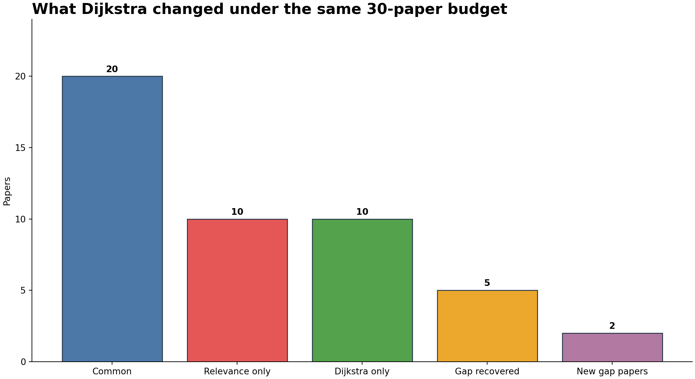
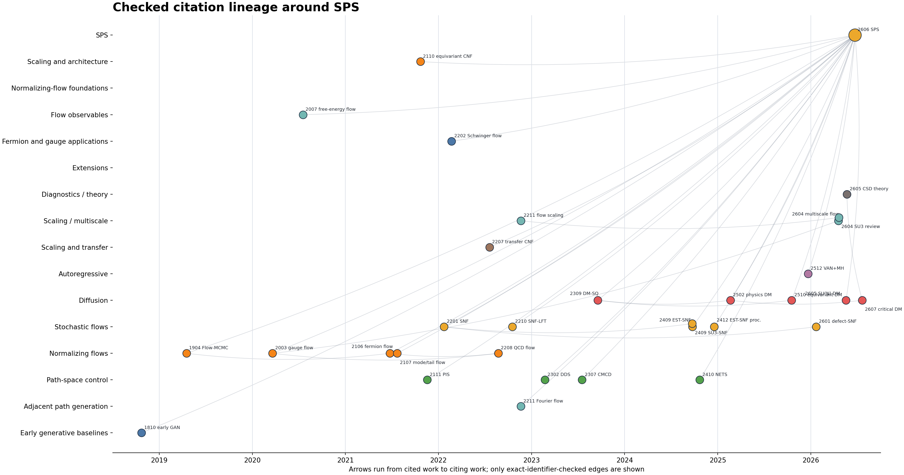

# SPS full Dijkstra run (2026-07-13)

This packet records an executable literature-graph run rooted at
`arXiv:2606.13790`. It isolates the effect of adding a Dijkstra reading gate to
the same 593-paper candidate pool, then continues through source verification,
full-text reading, gap closure, evidence ledgers, lineage views, and final
validation.

## What changed when Dijkstra was used

| Observable | Relevance only | Candidate Dijkstra | Final Dijkstra + gap closure |
|---|---:|---:|---:|
| papers selected | 30 | 30 | 37 |
| overlap with the relevance-only set | 30 | 20 | 35 |
| exact root-bibliography papers | 19 | 21 | 21 |
| declared facets covered | 7 | 7 | 10 |
| method groups covered | 8 | 8 | 8 |
| mean heuristic screen score | 16.700 | 16.067 | not comparable |

At equal reading budget, Dijkstra replaced 10 of 30 papers and retained two
additional exact ancestors from the SPS bibliography. It did not improve the
coarse facet or method-group counts, and it slightly lowered the mean keyword
screen score. The later gap loop recovered five useful baseline-only papers and
added two new boundary/frontier papers.

This supports Dijkstra as a navigation and reading-priority mechanism. It does
not show a universal quality gain, prove completeness, or turn path distance
into scientific evidence.



## What the complete run produced

| Output | Recorded value |
|---|---:|
| first-round query routes | 36 |
| raw / deduplicated candidates | 667 / 593 |
| candidate graph | 3,300 nodes / 8,187 weighted edges |
| verified and read papers | 37 |
| verified PDF pages | 776 |
| evidence entries | 185 |
| checked direct-citation relations | 199 |
| verified graph | 164 nodes / 944 weighted edges |
| final validation | 19 / 19 gates passed |

The PDFs were checked locally but are not redistributed. Their identities,
URLs, hashes, page counts, reading anchors, and source status remain in the
public ledgers.



## Cost boundary

| Measurement | Value | Meaning |
|---|---:|---|
| complete goal-mode elapsed time | 4,039 s (67 min 19 s) | search through final packaging |
| wall time through validation | 3,656 s (60 min 56 s) | validated artifact snapshot |
| complete goal-mode tokens | 1,012,083 | cumulative task counter |
| generic Dijkstra runner | 0.11 s | one local run: CSV load + graph pass + CSV write |
| monetary API cost | unavailable | no API usage object or API key was used |

The relevance-only and Dijkstra sets were computed inside one shared workflow.
They were not two independent end-to-end runs, so separate token or elapsed
costs for the two arms are not available. The 0.11 s benchmark measures only
the deterministic graph computation, not literature search or paper reading.

See [`runtime_accounting.md`](runtime_accounting.md) and
[`algorithm_benchmark.md`](algorithm_benchmark.md) for the measurement scope;
instrumented stage rows are preserved in
[`logs/timing_log.csv`](logs/timing_log.csv).

## Start with these files

| Question | File |
|---|---|
| Which papers changed? | [`dijkstra_effect_evaluation.md`](dijkstra_effect_evaluation.md) |
| What is the row-level comparison? | [`dijkstra_selection_comparison.csv`](dijkstra_selection_comparison.csv) |
| How were graph costs defined? | [`dijkstra_weight_policy.md`](dijkstra_weight_policy.md) |
| Can paths be recomputed? | [`dijkstra_candidate_graph_nodes.csv`](dijkstra_candidate_graph_nodes.csv), [`dijkstra_candidate_graph_edges.csv`](dijkstra_candidate_graph_edges.csv), [`dijkstra_candidate_shortest_paths.csv`](dijkstra_candidate_shortest_paths.csv) |
| What was read from each paper? | [`manual_reading_notes.csv`](manual_reading_notes.csv) |
| What does one native full-paper record look like? | [`native_paper_reading_record_sps.md`](native_paper_reading_record_sps.md) and [`native_paper_reading_ledger.csv`](native_paper_reading_ledger.csv) |
| Which claims survive a review gate? | [`native_paper_review_gate_sps.md`](native_paper_review_gate_sps.md) |
| Which source supports each claim? | [`claim_source_ledger.md`](claim_source_ledger.md) |
| What remains unresolved? | [`gap_ledger.csv`](gap_ledger.csv) |
| What is the final synthesis? | [`literature_research_report.md`](literature_research_report.md) |
| Did the run pass its gates? | [`final_validation_report.md`](final_validation_report.md) |
| What does the workbook look like? | [`sps_literature_audit_full_dijkstra.xlsx`](sps_literature_audit_full_dijkstra.xlsx) and [`contact_sheet.png`](qa_workbook/contact_sheet.png) |

## Recompute the generic shortest paths

From this directory, run:

```bash
python3 ../../../play-the-toy-with-children/scripts/run_literature_dijkstra.py \
  --nodes dijkstra_candidate_graph_nodes.csv \
  --edges dijkstra_candidate_graph_edges.csv \
  --root paper:arxiv:2606.13790 \
  --output-dir ./recomputed-dijkstra
```

The project-specific graph builders and validators are preserved under
[`scripts/`](scripts/). The public-export validator checks the graph and ledger
invariants without requiring the copyrighted local PDF cache:

```bash
python3 ../../scripts/validate_dijkstra_public_run.py
```

## Exact invocation pattern

```text
Use $play-the-toy-with-children.
intent=cover, scan=full, graph_mode=on, optimizer=dijkstra.
Start from arXiv:2606.13790. Run the algorithm; do not only describe it.
Preserve graph nodes, weighted edges, shortest paths, recomputed path costs,
source verification, the gap-closure loop, and an equal-budget comparison
against non-graph ranking. Return every claim and number to the original source.
```
